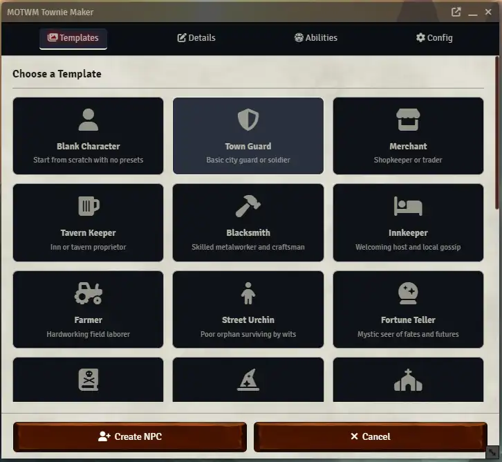
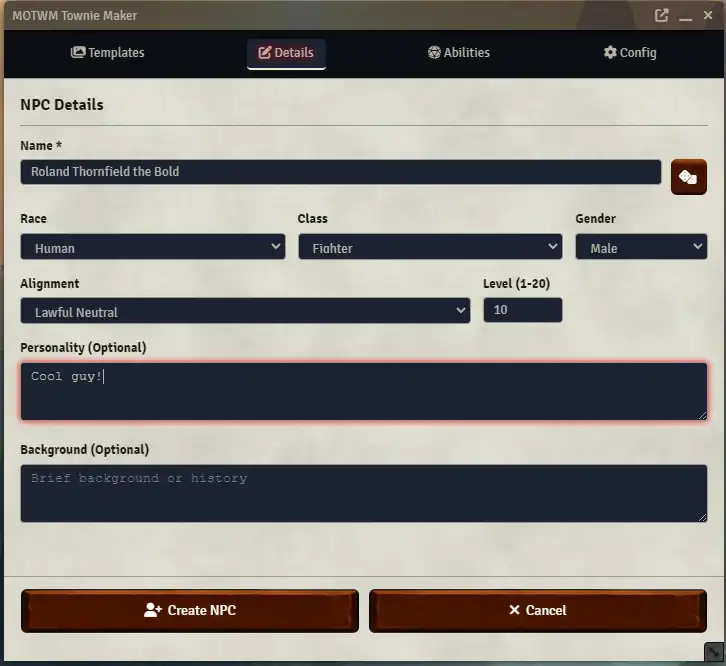
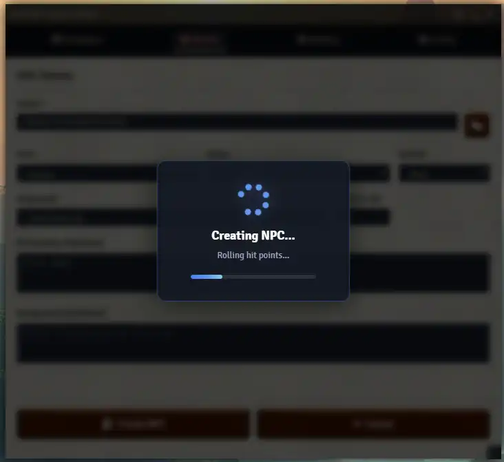

# MOTWM Townie Maker

In D&D terms, a “townie” isn’t an insult, it’s a job description. They are the people who actually live here. They remember what used to be where that new building is, know every petty feud within three blocks, and can tell you exactly when “things started going downhill” (usually right after the old inn burned down).

They’re the ones who know which alley is “technically safe,” which merchant waters down the ale, and why you absolutely do not ask Old Man Harven about the scarecrow incident.

Adventurers are the opposite: they roll in from Somewhere Else, turn local problems into XP, and leave with a suspicious amount of your town’s “unclaimed” treasure.

Townies keep the setting running. Adventurers keep the encounter tables employed.

Townie Maker helps you generate the regular locals *and* the troublemakers — and even when you ask for “adventurers,” you’re really getting townie adventurers.

**MOTWM Townie Maker** is a comprehensive NPC and adversary creation tool for Foundry VTT’s D35E (D&D 3.5e) system. Generate fully-equipped, combat-ready characters in seconds using intelligent templates and automated systems.

> **Beta release note:** This module is in active development. Core NPC generation works, but some areas (template coverage, edge-case rules, and advanced automation) may still change.

## Quick Start (With Pictures)

1. Open the **Actors** tab and click the **Townie Maker** button ("user-plus" icon) in the Actors Directory header (GM-only).
2. Select the template you want to use.



3. Change the level (and any other details you want).



4. Click **Create NPC** and Townie Maker will generate the actor and open the sheet.



That’s it, enjoy your new townie!

## Table of Contents

- [Quick Start (With Pictures)](#quick-start-with-pictures)
- [Overview](#overview)
- [Features](#features)
- [Installation](#installation)
- [Beta Status and Known Limitations](#beta-status-and-known-limitations)
- [Quick Start](#quick-start)
- [Character Templates](#character-templates)
- [Adding Custom Templates](#adding-custom-templates)
- [Core Systems](#core-systems)
  - [Ability Scores](#ability-scores)
  - [Class and Level](#class-and-level)
  - [Race Selection](#race-selection)
  - [Skill Allocation](#skill-allocation)
  - [Feat Selection](#feat-selection)
  - [Equipment System](#equipment-system)
  - [Magic Item System](#magic-item-system)
  - [Spell System](#spell-system)
  - [Consumables](#consumables)
- [Configuration Options](#configuration-options)
- [Loot and Token Options](#loot-and-token-options)
- [Development](#development)
- [Technical Details](#technical-details)
- [License](#license)
- [Credits](#credits)
- [Support](#support)

---

## Overview

**MOTWM Townie Maker** solves the common GM problem of needing quick, balanced NPCs for encounters. Instead of spending hours building characters by hand or using generic stat blocks, Townie Maker generates fully-realized characters with:

- Appropriate equipment for their level and class
- Magic items following "Big Six" priority guidelines
- Properly allocated skills based on class priorities
- Level-appropriate feats with correct configurations
- Prepared spells for caster classes
- Consumables (wands, scrolls, potions) based on character type
- Randomized wealth in realistic coin denominations

The goal is to create NPCs that feel like real townfolk who could plausibly exist in your game world.

## Features

### Core Features
- **20+ Character Templates** - Predefined archetypes for common NPCs
- **Levels 1-20** - Full support for all character levels
- **11 Core Classes** - Fighter, Barbarian, Monk, Paladin, Ranger, Rogue, Bard, Cleric, Druid, Sorcerer, Wizard
- **5 NPC Classes** - Adept, Aristocrat, Commoner, Expert, Warrior
- **12 Races** - Human, Elves (High/Wood/Drow), Dwarves (Hill/Mountain), Gnome, Halfling, Half-Elf, Half-Orc, Aasimar, Tiefling

### Intelligent Systems
- **Wealth-by-Level** - Automatic wealth calculation from DMG guidelines
- **Smart Equipment** - Level-scaled mundane and magic equipment
- **Magic Item Budget** - Class-appropriate budget allocation (martial vs. caster vs. divine)
- **Big Six Priority** - Weapon, Armor, Stat Booster, Cloak of Resistance, Ring of Protection, Amulet of Natural Armor
- **Spell Preparation** - Automatic spell selection and preparation for casters
- **Consumable Allocation** - Wands, scrolls, and potions based on class type

### Quality of Life
- **Random Name Generation** - Race and gender-appropriate fantasy names
- **Portrait & Token Images** - Automatic image selection based on race/class/gender
- **Coin Randomization** - Realistic distribution across pp/gp/sp/cp
- **Unidentified Magic Items** - Perfect for loot with generic base item names
- **Bank Deposit Slips** - Excess wealth as in-game prop items
- **Token Disposition** - Set default attitude (Friendly/Neutral/Hostile)

---

## Installation

### Method 1: Manifest URL (Recommended)
1. In Foundry VTT, go to **Add-on Modules**
2. Click **"Install Module"**
3. Paste the manifest URL:
   ```
   https://raw.githubusercontent.com/Xombit/motwm-townie-maker/main/module.json
   ```
4. Click **"Install"**

### Method 2: Manual Installation
1. Download the latest release from GitHub
2. Extract to your `modules` folder
3. Restart Foundry VTT

### Requirements
- Foundry VTT v10 or v11
- D35E System v2.1.3 or higher

---

## Beta Status and Known Limitations

- Output depends on the D35E compendium content and IDs; if you use a different D35E version than expected, some items/spells may not be found.
- Some class-specific edge cases are still being refined (e.g. specialist wizard slot handling).
- Inventory organization: the module uses D35E container fields and performs a delayed “organize inventory” pass after creation. If you have custom systems/modules that modify items during creation, container moves may behave differently.
- Templates are loaded from `data/templates.json` at runtime. There is no in-Foundry template editor yet; edit the JSON file directly (see [Adding Custom Templates](#adding-custom-templates)).

---

## Quick Start

1. **Enable the module** in your world's Module Settings
2. Open the **Actors Directory** and click **Townie Maker** ("user-plus" icon) in the directory header (GM-only)
3. **Select a template** from the gallery (e.g., "Town Guard")
4. **Adjust level** to desired character level
5. **Click "Create NPC"** to generate the character

The character will be created with:
- Full equipment appropriate for their level
- Magic items based on wealth-by-level guidelines
- Prepared spells (if applicable)
- Properly allocated skills and feats
- Random name, portrait, and token

---

## Character Templates

### Built-in Templates (Current)

Templates provide pre-configured character concepts with appropriate class, race, ability scores, skills, feats, and starting equipment.

The current built-in templates are defined in `data/templates.json`.

### Martial / Adventurer Templates

| Template | Class | Race | Description |
|----------|-------|------|-------------|
| **Town Guard** | Fighter | Human | Basic city guard or soldier |
| **Bandit** | Warrior (NPC) | Human | Highway robber or outlaw |
| **Tribal Warrior** | Barbarian | Half-Orc | Fierce wilderness warrior |
| **Holy Knight** | Paladin | Human | Righteous champion of good |
| **Ranger Scout** | Ranger | Elf, High | Wilderness guide/tracker (archery style) |
| **Monastery Disciple** | Monk | Human | Martial artist and ascetic |
| **Street Thief** | Rogue | Halfling, Lightfoot | Pickpocket or burglar |

### Caster Templates

| Template | Class | Race | Description |
|----------|-------|------|-------------|
| **Wizard** | Wizard | Human | Scholar of arcane magic |
| **Battle Cleric** | Cleric | Human | Melee + divine support (has shield) |
| **Caster Cleric** | Cleric | Human | Spell-focused cleric (no shield) |
| **Forest Hermit** | Druid | Human | Guardian of nature and the wild |
| **Born Spellcaster** | Sorcerer | Human | Innate magic wielder |
| **Traveling Minstrel** | Bard | Half-Elf | Entertainer and storyteller |

### NPC Templates

| Template | Class | Race | Description |
|----------|-------|------|-------------|
| **Merchant** | Expert (NPC) | Human | Shopkeeper, trader |
| **Tavern Keeper** | Commoner (NPC) | Human | Inn or tavern proprietor |
| **Blacksmith** | Expert (NPC) | Dwarf, Mountain | Skilled metalworker and craftsman |
| **Innkeeper** | Commoner (NPC) | Halfling, Lightfoot | Welcoming host and local gossip |
| **Farmer** | Commoner (NPC) | Human | Hardworking field laborer |
| **Street Urchin** | Commoner (NPC) | Human | Poor orphan surviving by wits |
| **Fortune Teller** | Adept (NPC) | Half-Elf | Mystic seer of fates and futures |
| **Noble** | Aristocrat (NPC) | Human | Aristocrat or wealthy merchant |
| **Village Healer** | Adept (NPC) | Human | Simple divine caster (NPC class) |
| **Dark Cultist** | Adept (NPC) | Human | Devotee of sinister powers |

---

## Adding Custom Templates

Templates are loaded from an external JSON file at runtime.

If you want to add or modify templates:

1. Edit `data/templates.json`.
2. Reload Foundry (or refresh the page) and re-open Townie Maker.

Important: `data/templates.json` must be **strict JSON**.

- No comments (`//` or `/* ... */`)
- No trailing commas

If the JSON fails to load/parse, Townie Maker will fall back to a minimal “Blank Character” template and show an error banner in the **Templates** tab.

Note (beta workflow): this file currently lives inside the module folder, so updating the module may overwrite it.

### Example Templates (Copy/Paste)

Each template in `data/templates.json` is a plain JSON object inside the top-level array.

These examples are designed to be copied into the array as-is (adjust item names/races to match your world’s compendiums).

#### Example: Fighter (Frontline Soldier)

```json
{
  "id": "example-fighter",
  "name": "Example Fighter",
  "description": "Frontline soldier with heavy armor and a shield",
  "icon": "fas fa-shield-alt",
  "race": "Human",
  "alignment": "Lawful Neutral",
  "classes": [{ "name": "Fighter", "level": 1 }],
  "primaryAbility": "str",
  "abilities": { "str": 15, "dex": 12, "con": 14, "int": 10, "wis": 10, "cha": 8 },
  "skills": [
    { "name": "clm", "ranks": 2, "priority": "medium" },
    { "name": "jmp", "ranks": 2, "priority": "medium" },
    { "name": "int", "ranks": 2, "priority": "medium" },
    { "name": "rid", "ranks": 2, "priority": "low" }
  ],
  "feats": [
    "Power Attack",
    "Cleave",
    { "name": "Weapon Focus (No Weapon Selected)", "displayName": "Weapon Focus (Longsword)", "config": { "weaponGroup": "Longsword" } }
  ],
  "startingKit": {
    "weapons": [{ "name": "Longsword", "cost": 15, "weight": 4, "type": "weapon" }],
    "armor": [
      { "minLevel": 1, "item": { "name": "Scale Mail", "cost": 50, "weight": 30, "type": "armor" } },
      { "minLevel": 11, "item": { "name": "Full Plate", "cost": 1500, "weight": 50, "type": "armor" } }
    ],
    "shield": { "name": "Heavy Steel Shield", "cost": 20, "weight": 15, "type": "shield" },
    "gear": [
      { "name": "Backpack, Common", "cost": 2, "weight": 2, "type": "gear" },
      { "name": "Waterskin", "cost": 1, "weight": 4, "type": "gear" },
      { "name": "Rations, Trail", "cost": 0.5, "weight": 1, "quantity": 7, "type": "gear" }
    ]
  },
  "usePcSheet": true,
  "useStandardBudget": true,
  "useMaxHpPerHD": false
}
```

#### Example: Wizard (Arcane Scholar)

```json
{
  "id": "example-wizard",
  "name": "Example Wizard",
  "description": "Arcane caster with a simple kit and spell-focused feats",
  "icon": "fas fa-hat-wizard",
  "race": "Human",
  "alignment": "Neutral",
  "classes": [{ "name": "Wizard", "level": 1 }],
  "primaryAbility": "int",
  "abilities": { "str": 8, "dex": 14, "con": 12, "int": 16, "wis": 10, "cha": 10 },
  "skills": [
    { "name": "spl", "ranks": 4, "priority": "high" },
    { "name": "coc", "ranks": 4, "priority": "high" },
    { "name": "kar", "ranks": 4, "priority": "medium" },
    { "name": "khi", "ranks": 2, "priority": "low" }
  ],
  "feats": [
    "Improved Initiative",
    { "name": "Spell Focus (No Spell School Selected)", "displayName": "Spell Focus (Evocation)", "config": { "spellSchool": "evo" } },
    "Combat Casting"
  ],
  "startingKit": {
    "weapons": [
      { "name": "Quarterstaff", "cost": 0, "weight": 4, "type": "weapon" },
      { "name": "Light Crossbow", "cost": 35, "weight": 4, "type": "weapon" }
    ],
    "ammo": [{ "name": "Crossbow Bolt", "cost": 0.1, "weight": 0.1, "quantity": 20, "type": "ammo" }],
    "tools": [
      { "name": "Spellbook", "cost": 15, "weight": 3, "type": "tool" },
      { "name": "Spell Component Pouch", "cost": 5, "weight": 2, "type": "tool" }
    ],
    "gear": [
      { "name": "Backpack, Common", "cost": 2, "weight": 2, "type": "gear" },
      { "name": "Ink", "cost": 8, "weight": 0, "type": "gear" },
      { "name": "Inkpen", "cost": 0.1, "weight": 0, "type": "gear" }
    ]
  },
  "personality": "Curious, impatient, always taking notes.",
  "background": "Trained under a reclusive master; now cataloging local ruins.",
  "usePcSheet": true,
  "useStandardBudget": true
}
```

#### Example: Rogue (Street Thief)

```json
{
  "id": "example-rogue",
  "name": "Example Rogue",
  "description": "Stealth-focused rogue with thief tools",
  "icon": "fas fa-mask",
  "race": "Halfling, Lightfoot",
  "alignment": "Chaotic Neutral",
  "classes": [{ "name": "Rogue", "level": 1 }],
  "primaryAbility": "dex",
  "abilities": { "str": 8, "dex": 16, "con": 12, "int": 12, "wis": 10, "cha": 10 },
  "skills": [
    { "name": "hid", "ranks": 4, "priority": "high" },
    { "name": "mos", "ranks": 4, "priority": "high" },
    { "name": "opl", "ranks": 4, "priority": "high" },
    { "name": "dev", "ranks": 4, "priority": "medium" },
    { "name": "slt", "ranks": 2, "priority": "medium" }
  ],
  "feats": ["Weapon Finesse", "Dodge", "Mobility"],
  "rogueSpecialAbilities": ["Crippling Strike", "Opportunist"],
  "startingKit": {
    "weapons": [
      { "name": "Rapier", "cost": 20, "weight": 2, "type": "weapon" },
      { "name": "Shortbow", "cost": 30, "weight": 2, "type": "weapon" }
    ],
    "armor": { "name": "Studded Leather", "cost": 25, "weight": 20, "type": "armor" },
    "ammo": [{ "name": "Arrow", "cost": 0.05, "weight": 0.15, "quantity": 40, "type": "ammo" }],
    "tools": [{ "name": "Thieves' Tools", "cost": 30, "weight": 1, "type": "tool" }],
    "gear": [{ "name": "Backpack, Common", "cost": 2, "weight": 2, "type": "gear" }]
  },
  "useStandardBudget": true
}
```

#### Example: Ranger (Scout, Archery Style)

```json
{
  "id": "example-ranger",
  "name": "Example Ranger",
  "description": "Wilderness tracker with archery combat style",
  "icon": "fas fa-tree",
  "race": "Elf, High",
  "alignment": "Neutral Good",
  "classes": [{ "name": "Ranger", "level": 1 }],
  "primaryAbility": "dex",
  "abilities": { "str": 12, "dex": 16, "con": 12, "int": 10, "wis": 14, "cha": 8 },
  "rangerCombatStyle": "archery",
  "favoredEnemies": ["Humanoid (Orc)", "Giant"],
  "skills": [
    { "name": "sur", "ranks": 4, "priority": "high" },
    { "name": "lis", "ranks": 4, "priority": "high" },
    { "name": "spt", "ranks": 4, "priority": "high" },
    { "name": "kna", "ranks": 2, "priority": "medium" },
    { "name": "hid", "ranks": 2, "priority": "medium" }
  ],
  "feats": ["Track", "Point Blank Shot", "Precise Shot"],
  "startingKit": {
    "weapons": [
      { "name": "Longbow", "cost": 75, "weight": 3, "type": "weapon" },
      { "name": "Longsword", "cost": 15, "weight": 4, "type": "weapon" }
    ],
    "armor": { "name": "Studded Leather", "cost": 25, "weight": 20, "type": "armor" },
    "ammo": [{ "name": "Arrow", "cost": 0.05, "weight": 0.15, "quantity": 40, "type": "ammo" }],
    "gear": [
      { "name": "Backpack, Common", "cost": 2, "weight": 2, "type": "gear" },
      { "name": "Rations, Trail", "cost": 0.5, "weight": 1, "quantity": 14, "type": "gear" }
    ]
  },
  "magicItemBudgets": {
    "shieldPercent": 0.4,
    "armorPercent": 0.6,
    "secondaryWeaponPercent": 0.5,
    "ringPercent": 0.6,
    "amuletPercent": 0.4
  }
}
```

### Template Schema

The template object shape is `TownieTemplate` in `src/types.d.ts`.

This section documents the fields the generator actually consumes today.

#### Template Fields Reference

**Metadata (shown in the Template picker)**

- `id` (string, required): Unique template id.
- `name` / `description` (string, required): Display name/description.
- `icon` (string, required): Font Awesome class (e.g. `"fas fa-shield-alt"`).

**Core build inputs**

- `race` (string): Race name as it appears in the D35E race compendium.
- `alignment` (string): Written directly to the actor.
- `classes` (array of `{ name, level }`): Used to pre-fill the form.
  - Current limitation: only `classes[0]` is used for actual creation.
- `abilities` (object): The *actual ability scores* to set on the actor (not modifiers).
  - Recommendation: provide all six abilities to avoid carrying values over from a previously-selected template.
- `primaryAbility` (`"str" | "dex" | "con" | "int" | "wis" | "cha"`): Used during HP/level processing (when auto-rolling HP) to decide which ability gets the level-based increases.

**Skills**

- `skills` (array of `{ name, ranks, priority? }`): Adds skills after class/HP are set.
  - `name` is a D35E skill id like `"clm"`, `"dip"`, etc.
  - Subskills are supported on the **PC sheet** path using `"crf1:Weaponsmithing"` / `"pro1:Sailor"` / `"prf1:Sing"`.
  - `priority` controls allocation (`high`/`medium`/`low`). If omitted, that entry currently gets 0 points.
  - Current limitation: `ranks` is currently ignored by the allocator (priority drives the distribution).
  - Current limitation: subskills are not implemented on the **Simple NPC sheet** path.

<details>
<summary>Skill ID reference (D35E internal skill keys)</summary>

These IDs are the keys under `actor.system.skills` in the D35E system.

| ID | Skill name |
|---|---|
| `apr` | Appraise |
| `aut` | Autohypnosis |
| `blc` | Balance |
| `blf` | Bluff |
| `clm` | Climb |
| `coc` | Concentration |
| `crf` | Craft (base skill; use subskills like `crf1:Armorsmithing`) |
| `dev` | Disable Device |
| `dip` | Diplomacy |
| `dis` | Disguise |
| `dsc` | Decipher Script |
| `esc` | Escape Artist |
| `fog` | Forgery |
| `gif` | Gather Information |
| `han` | Handle Animal |
| `hea` | Heal |
| `hid` | Hide |
| `int` | Intimidate |
| `jmp` | Jump |
| `kar` | Knowledge (Arcana) |
| `kdu` | Knowledge (Dungeoneering) |
| `ken` | Knowledge (Engineering) |
| `kge` | Knowledge (Geography) |
| `khi` | Knowledge (History) |
| `klo` | Knowledge (Local) |
| `kna` | Knowledge (Nature) |
| `kno` | Knowledge (Nobility) |
| `kpl` | Knowledge (Planes) |
| `kps` | Knowledge (Psionics) |
| `kre` | Knowledge (Religion) |
| `lis` | Listen |
| `mos` | Move Silently |
| `opl` | Open Lock |
| `prf` | Perform (base skill; use subskills like `prf1:Sing`) |
| `pro` | Profession (base skill; use subskills like `pro1:Sailor`) |
| `psi` | Psicraft |
| `rid` | Ride |
| `sen` | Sense Motive |
| `slt` | Sleight of Hand |
| `spk` | Speak Language |
| `spl` | Spellcraft |
| `spt` | Spot |
| `src` | Search |
| `sur` | Survival |
| `swm` | Swim |
| `tmb` | Tumble |
| `umd` | Use Magic Device |
| `upd` | Use Psionic Device |
| `uro` | Use Rope |

</details>

**Feats**

- `feats` (array): Either feat name strings, or configured feat objects (`FeatConfig`).
  - Ordering matters: the allocator consumes the list in order (class bonus feats first, then general feats).

The `feats` list supports two forms:

- **Simple feat**: a string with the exact feat name as it appears in your D35E feat compendium.
- **Configured feat (`FeatConfig`)**: use this when the feat requires a choice (spell school, weapon, or skill).

Important: for configured feats, `FeatConfig.name` must still match a real compendium feat name (it’s the lookup key). In practice, that means using the system’s “placeholder” version like `"Spell Focus (No Spell School Selected)"`.

#### FeatConfig: Spell schools (`config.spellSchool`)

Used for **Spell Focus** and **Greater Spell Focus**.

- `config.spellSchool` is a D35E school code:

| Code | School |
|---|---|
| `abj` | Abjuration |
| `con` | Conjuration |
| `div` | Divination |
| `enc` | Enchantment |
| `evo` | Evocation |
| `ill` | Illusion |
| `nec` | Necromancy |
| `trs` | Transmutation |

Example:

```json
{
  "name": "Spell Focus (No Spell School Selected)",
  "config": { "spellSchool": "evo" }
}
```

#### FeatConfig: Weapon choice (`config.weaponGroup`)

Used for weapon-based feats like **Weapon Focus**, **Weapon Specialization**, **Greater Weapon Focus**, **Greater Weapon Specialization**, and **Improved Critical**.

- Despite the property name, `weaponGroup` is treated as a **weapon name** and written into the feat’s "Weapon Name" field.
- Use the exact weapon name your D35E content uses (e.g., `"Longsword"`, `"Shortbow"`, etc.).

Example:

```json
{
  "name": "Weapon Focus (No Weapon Selected)",
  "config": { "weaponGroup": "Longsword" }
}
```

#### FeatConfig: Skill choice (`config.skill`)

Used for **Skill Focus**.

- `config.skill` uses D35E skill IDs (like `"dip"`). See the "Skill ID reference" table above.
- Subskills are supported (Craft/Profession/Perform):
  - `"crf1:Armorsmithing"`
  - `"pro1:Sailor"`
  - `"prf1:Sing"`

Examples:

```json
{
  "name": "Skill Focus (undefined)",
  "config": { "skill": "dip" }
}
```

```json
{
  "name": "Skill Focus (undefined)",
  "config": { "skill": "prf1:Sing" }
}
```

Notes:
- `FeatConfig.displayName` exists in the schema for readability, but the current generator primarily uses `name` for compendium lookup and then applies configuration; don’t rely on `displayName` to change what gets created.
- If you’re unsure of the correct `name` string for a configured feat, open your D35E feat compendium and copy the exact entry name (the one that contains “No Weapon Selected” / “No Spell School Selected” / etc.).

**Starting equipment**

- `startingKit` (`StartingKit`): The starting equipment kit (see [Equipment System](#equipment-system)).
  - Each entry is an `EquipmentOption`, which can be:
    - a single `EquipmentItem`
    - an array of `EquipmentItem[]` (random choice)
    - an array of `{ minLevel, item }[]` (level-scaled choice)
  - `EquipmentItem.name` must match the D35E compendium item name you have installed.
  - `EquipmentItem.cost` is in gp and is used for budget math.

**Magic item configuration**

- `useStandardBudget` (boolean, default: `true`):
  - When `false`, the NPC gets no magic items (and only a small “token gold” amount).
- `magicItemBudgets` (object): Optional overrides for budget splits used by the magic item system.
  - Values are stored as fractions (e.g. `0.4` = 40%).
  - `shieldPercent` / `armorPercent`: Splits the “armor budget” between shield vs armor.
  - `secondaryWeaponPercent`: Splits the “weapon budget” between primary vs secondary weapon.
  - `ringPercent` / `amuletPercent`: Splits the “protection budget” between ring vs amulet.

**Sheet / HP configuration**

- `usePcSheet` (boolean, default: `true`): When `false`, use the Simple NPC sheet path.
- `useMaxHpPerHD` (boolean, default: `false`): When enabled and auto-roll HP is on, uses max HP per hit die.

**Class-specific fields**

- `rangerCombatStyle` (`"archery" | "two-weapon"`): If set and the class is Ranger, adds combat-style feats at levels 2/6/11.
- `favoredEnemies` (string[]): If present on a Ranger template, entries are applied at 1/5/10/15/20.
- `rogueSpecialAbilities` (string[]): If present on a Rogue template, entries are applied at 10/13/16/19.

**Flavor**

- `personality` / `background` (string): Optional text used to build Biography sections.

### Subtleties To Know (Templates Drive Behavior)

- Cleric/Druid “melee vs caster” detection: the magic item system uses whether `startingKit.shield` exists to decide which variant budget to use.
  - If you want a spell-focused Cleric/Druid, omit the shield in `startingKit`.
  - If you want a 2H-style build, omit the shield (the generator does not try to reconcile incompatible kits).
- Ranger combat style feats are only added when the template defines `rangerCombatStyle`.
- Weapon-specific feats (Fighter/Paladin/etc): for feats like Weapon Focus / Improved Critical, use `FeatConfig` with `config.weaponGroup`.
  - The system will set the D35E “Weapon Name” custom attribute and rename the feat to match.
- Feat ordering matters: the feat allocator consumes your `feats` list in order, assigning class bonus feats first (e.g., Fighter) and then standard feats.

Template notes: templates are currently loaded from `data/templates.json` at runtime (no rebuild required).

---

## Core Systems

### Ability Scores

The module supports two methods for generating ability scores:

#### Standard Array (Default)
Uses the standard D&D point-buy equivalent: **15, 14, 13, 12, 10, 8**

Templates assign these values to abilities based on class priorities:
- **Fighters**: STR 15, CON 14, DEX 13, WIS 12, INT 10, CHA 8
- **Wizards**: INT 15, DEX 14, CON 13, WIS 12, STR 10, CHA 8
- **Rogues**: DEX 15, INT 14, CON 13, WIS 12, STR 10, CHA 8

#### 4d6 Drop Lowest
Rolls 4d6, drops the lowest die, for each ability score. Results are assigned based on template ability priorities.

#### Manual Override
All ability scores can be manually adjusted in the Character tab after selecting a template.

---

### Class and Level

#### Supported Classes

**Core Classes (d20 SRD)**
- Fighter, Barbarian, Monk, Paladin, Ranger, Rogue
- Bard, Cleric, Druid, Sorcerer, Wizard

**NPC Classes**
- Warrior (NPC) - Simple combatant
- Expert (NPC) - Skilled professional
- Commoner (NPC) - Average citizen
- Aristocrat (NPC) - Noble or merchant
- Adept (NPC) - Minor spellcaster

#### Level Scaling

Equipment and wealth scale automatically with level:

| Level | Wealth (gp) | Magic Item Tier |
|-------|-------------|-----------------|
| 1 | Class starting | None |
| 3 | 2,700 | +1 weapon/armor |
| 5 | 9,000 | +1 with abilities |
| 8 | 27,000 | +2, stat boosters |
| 12 | 88,000 | +3, multiple items |
| 15 | 200,000 | +4, powerful items |
| 20 | 760,000 | +5, epic tier |

---

### Race Selection

#### Supported Races

| Race | Ability Adjustments |
|------|---------------------|
| Human | None |
| Elf, High | +2 DEX, -2 CON |
| Elf, Wood | +2 STR, -2 INT |
| Elf, Drow | +2 DEX, -2 CON |
| Dwarf, Hill | +2 CON, -2 CHA |
| Dwarf, Mountain | +2 CON, -2 CHA |
| Gnome, Rock | +2 CON, -2 STR |
| Halfling, Lightfoot | +2 DEX, -2 STR |
| Half-Elf | None |
| Half-Orc | +2 STR, -2 INT, -2 CHA |
| Aasimar | +2 WIS, +2 CHA |
| Tiefling | +2 DEX, +2 INT, -2 CHA |

Each race has custom name pools for realistic fantasy name generation.

---

### Skill Allocation

Skills are allocated using a priority system:

#### Priority Levels
- **High Priority**: Receives maximum possible ranks (level + 3)
- **Medium Priority**: Receives moderate ranks (half growth)
- **Low Priority**: Receives minimal ranks (quarter growth)

#### Class Skill Points
Skill points are calculated correctly per class:
- Fighter: 2 + INT modifier per level
- Rogue: 8 + INT modifier per level
- Wizard: 2 + INT modifier per level
- etc.

First level characters receive 4× skill points as per 3.5e rules.

#### Template Skills
Each template defines appropriate skills for the character concept:
- **Town Guard**: Climb (medium), Intimidate (medium), Jump (medium), Ride (medium)
- **Street Thief**: Hide (high), Move Silently (high), Open Lock (high)
- **Wizard**: Spellcraft (high), Concentration (high), Knowledge (Arcana) (medium)

---

### Feat Selection

#### Standard Feat Progression
Characters receive feats at levels 1, 3, 6, 9, 12, 15, 18.
Humans receive a bonus feat at level 1.

#### Class Bonus Feats
- **Fighter**: Bonus feats at 1, 2, 4, 6, 8, 10, 12, 14, 16, 18, 20
- **Wizard**: Bonus feats at 5, 10, 15, 20
- **Monk**: Bonus feats at 1, 2, 6
- **Ranger**: Combat style feats at 2, 6, 11

#### Feat Configurations
Feats requiring choices are automatically configured:
- **Weapon Focus / Weapon Specialization / Improved Critical**: Configured when the template uses a configured feat entry (`FeatConfig`) with `config.weaponGroup`
- **Spell Focus**: Configured when the template uses `FeatConfig` with `config.spellSchool` (school codes: `abj/con/div/enc/evo/ill/nec/trs`)
- **Skill Focus**: Configured when the template uses `FeatConfig` with `config.skill` (use a skill id like `"dip"` or a subskill like `"prf1:Sing"`)

Ranger combat style feats are added only when the selected template defines `rangerCombatStyle`.

Example: A Fighter template with a longsword gets:
- `Weapon Focus (Longsword)`
- `Weapon Specialization (Longsword)`
- `Improved Critical (Longsword)`

---

### Equipment System

#### Starting Kits
Each template defines a starting equipment kit:

```
Weapons: Longsword, Light Crossbow
Armor: Scale Mail
Shield: Heavy Steel Shield
Gear: Backpack, Bedroll, Waterskin, Trail Rations
Tools: Rope, Flint and Steel
```

#### Level Scaling
Starting-kit items support three option types:

- **Single item**: a single equipment entry
- **Random choice**: an array of items (one is chosen at random)
- **Level-scaled**: an array of `{ minLevel, item }` entries (highest applicable tier is chosen)

Level-scaling is per-item (e.g., a template might use Scale Mail at low levels and Full Plate at higher levels).

#### Equipment Categories
- **Weapons**: Primary and secondary weapons
- **Armor**: Body armor appropriate for class
- **Shield**: If proficient
- **Ammunition**: Arrows, bolts, sling bullets
- **Gear**: Adventuring equipment
- **Tools**: Class-specific tools (thieves' tools, holy symbol, spell components)

---

### Magic Item System

The magic item system allocates budget based on the "Big Six" priority system used by experienced D&D 3.5e players.

#### Budget Allocation by Class Type

Magic item budget allocation varies by class type.

Examples of default allocations:

- **Martial**: heavy emphasis on weapon + armor (including shield enhancements if a shield exists)
- **Pure arcane casters (Wizard/Sorcerer)**: no weapon/armor budget; more budget goes to protection + rods/staves
- **Divine casters (Cleric/Druid)**: no weapon budget; armor budget remains; weapon budget is redirected to rods/staves

Clerics and Druids have multiple variants (e.g. melee vs caster) based on the template’s loadout (notably whether a shield is present).

#### Big Six Items

1. **Weapon Enhancement**: +1 to +5 with special abilities (Flaming, Keen, etc.)
2. **Armor Enhancement**: +1 to +5 with special abilities (Fortification, etc.)
3. **Stat Booster**: Belt of Giant Strength, Headband of Intellect, etc.
4. **Cloak of Resistance**: +1 to +5 saves
5. **Ring of Protection**: +1 to +5 deflection AC
6. **Amulet of Natural Armor**: +1 to +5 natural AC

#### Enhancement Selection

Weapon enhancements are chosen based on class and weapon type:
- **Two-handed weapons**: Keen, Power Attack support
- **Archer weapons**: Distance, Seeking
- **Rogue weapons**: Keen (for sneak attack criticals)
- **Divine weapons**: Holy, Disruption

Armor enhancements prioritize defense:
- **Frontline fighters**: Fortification (Light → Moderate → Heavy)
- **Rogues**: Shadow, Silent Moves
- **Casters**: Energy Resistance

---

### Spell System

#### Supported Caster Types

| Class | Type | Ability | Spellbook |
|-------|------|---------|-----------|
| Wizard | Prepared | INT | Yes |
| Sorcerer | Spontaneous | CHA | No |
| Cleric | Prepared | WIS | Domain |
| Druid | Prepared | WIS | Nature |
| Bard | Spontaneous | CHA | No |
| Paladin | Prepared | CHA | Yes (4th level) |
| Ranger | Prepared | WIS | Yes (4th level) |

#### Spell Selection

Spells are selected based on:
1. **Class spell list** from D35E compendium
2. **Level availability** (can't prepare spells you can't cast)
3. **Role priorities** (blaster, healer, buffer, utility)

Example Wizard spells at level 5:
- 0th: Detect Magic, Read Magic, Light, Mage Hand
- 1st: Magic Missile, Shield, Mage Armor, Grease
- 2nd: Scorching Ray, Web, Invisibility
- 3rd: Fireball, Haste

#### Spell Slot Calculation

Spell slots are calculated correctly including:
- Base slots from class level
- Bonus slots from casting ability
- Domain slots for Clerics

---

### Consumables

If the character receives a **Handy Haversack**, the module will move newly-created consumables (wands/scrolls/potions) into it during the delayed **Organizing inventory** step. If no Handy Haversack exists, consumables are left uncontained.

#### Wands
Selected based on class spell list:
- **Wizard**: Wand of Magic Missile, Wand of Scorching Ray
- **Cleric**: Wand of Cure Light Wounds, Wand of Bless
- **Druid**: Wand of Entangle, Wand of Cure Moderate Wounds

Wands are created with appropriate charges based on budget.

#### Scrolls
Emergency spells and utility options:
- **Wizard**: Scroll of Dispel Magic, Scroll of Fly
- **Cleric**: Scroll of Remove Disease, Scroll of Restoration

#### Potions
Available to all classes (no UMD required):
- Potion of Cure Light Wounds
- Potion of Bull's Strength
- Potion of Cat's Grace
- Potion of Invisibility

Martial characters receive higher potion budgets since they can't use wands/scrolls without Use Magic Device.

---

## Configuration Options

### Config Tab Settings

#### Character Options
| Setting | Description | Default |
|---------|-------------|---------|
| **Use Standard Budget** | Follow wealth-by-level guidelines | ✓ Enabled |
| **Use PC Sheet** | Use full character sheet instead of Simple NPC | ✓ Enabled |
| **Max HP per HD** | Give maximum HP instead of rolling | ☐ Disabled |

#### Budget Percentages
Fine-tune magic item budget allocation:
- **Shield %**: Percentage of armor budget for shield enhancement
- **Armor %**: Percentage of armor budget for body armor
- **Secondary Weapon %**: Budget for backup weapons
- **Ring %**: Percentage of protection budget for Ring of Protection
- **Amulet %**: Percentage of protection budget for Amulet of Natural Armor

---

## Loot and Token Options

### Loot Options

#### Identify Magic Items
| Setting | Behavior |
|---------|----------|
| ✓ Enabled | Magic items created as identified (player-ready) |
| ☐ Disabled | Magic items created as unidentified with generic names |

When disabled, items use base type names for unidentified state:
- "+2 Flaming Longsword" → Unidentified: "Longsword"
- "Ring of Protection +3" → Unidentified: "Ring"
- "Cloak of Resistance +4" → Unidentified: "Cloak"

This is perfect for creating NPCs whose equipment will become player loot.

#### Extra Money in Bank
| Setting | Behavior |
|---------|----------|
| ✓ Enabled | Unused gold becomes a bank deposit slip item |
| ☐ Disabled | Unused gold is lost |

The deposit slip is a Loot-type item containing:
- Remaining gold after equipment purchases
- Pocket change (random 50-100% of level 1 starting wealth) will remain in the inventory

#### Bank Name
Customizable bank name for deposit slips.
Default: "The First Bank of Lower Everbrook"

### Token Options

#### Token Disposition
Sets the default attitude for the character's token:

| Setting | DISPOSITION Value | Behavior |
|---------|-------------------|----------|
| Friendly | 1 | Green border, won't trigger combat |
| Neutral | 0 | Yellow border (default) |
| Hostile | -1 | Red border, triggers combat |

---

## Development

### Quick Deploy to Foundry
```bash
npm install
npm run deploy
```

This builds and copies the module to your Foundry modules directory.

### Active Development
Run these in separate terminals for live updates:

```bash
npm run watch          # Terminal 1: Rebuilds on code changes
npm run dev:foundry    # Terminal 2: Auto-deploys to Foundry
```

### Build & Package
```bash
npm run build          # Build once
npm run deploy         # Deploy to Foundry
.\scripts\pack.ps1     # Create distribution .zip
```

The output zip is written to `packages/motwm-townie-maker.zip` (unversioned).

For more details, see [DEVELOPMENT.md](DEVELOPMENT.md).

---

## Technical Details

### System Requirements
- **Foundry VTT**: Version 10 or 11
- **Game System**: D35E v2.1.3+

### Compendium Dependencies
The module uses these D35E compendiums:
- `D35E.races` - Race data
- `D35E.classes` - Class data and progression
- `D35E.feats` - Feat definitions
- `D35E.spells` - Spell definitions
- `D35E.magicitems` - Wondrous items
- `D35E.weapons-and-ammo` - Weapon definitions
- `D35E.armors-and-shields` - Armor definitions
- `D35E.enhancements` - Weapon/armor enhancements

### Image Requirements
Character portraits and tokens are loaded at runtime from:
```
modules/motwm-townie-maker/images/artwork/[class]/[race]/[gender]/[portraits|tokens]/
```

You can **add new images or replace existing ones** by dropping files into those folders (no rebuild needed).

Rules enforced by the loader:
- **Tokens** are discovered by scanning the `tokens/` folder each time you create a character.
- A file is treated as a token only if its **filename ends with `.webp`** and **contains `token`** (lowercase) somewhere in the filename.
- The matching portrait path is generated by **replacing `token` → `portrait`** in the token filename and looking in the `portraits/` folder (the code does not verify the portrait exists).

Recommended naming convention:
- `femalehumanfightertoken01.webp`
- `femalehumanfighterportrait01.webp`

Portrait and token with matching numbers are paired sets.

### Module Settings
Located in Module Settings:

| Setting | Options | Description |
|---------|---------|-------------|
| Default Actor Type | Character, NPC | Type of actor to create |
| Auto Roll HP | Yes, No | Automatically roll HP on creation |
| Ability Score Method | Standard Array, 4d6 Drop Lowest | How to generate abilities |
| Default Folder | Text | Folder name for new actors |
| Default Sheet Type | PC Sheet, Simple NPC | Which character sheet to use |

---

## License

MIT License - See [LICENSE](LICENSE) file for details.

---

## Credits

### Created By

Created for **Melody of the Weirding Mover: Ahvindamahdorah’s Demise** by **Xombit the Zombie**.

### Acknowledgements

- **Foundry VTT** — for the platform that makes this possible.
- **Rughalt** — for the **D35E (D&D 3.5e) system for Foundry VTT** that this module targets.
- **Gary Gygax, Dave Arneson**, and **TSR** — for creating the original game of Dungeons & Dragons.
- **Wizards of the Coast** — for continuing to publish Dungeons & Dragons, and the **d20 System Reference Document (SRD)** that the D35E system implements.

### Art Credits

All included character portraits and tokens in this repository are **created using generative AI technology** and are licensed under the **same license as this module**.

You are free to use the included art as you see fit.

---

## Support

- **Issues**: Report bugs on [GitHub Issues](https://github.com/Xombit/motwm-townie-maker/issues)

For discussion, feedback, and community support, you can also check:

- **LotD / 3.5 SRD for FVTT** Discord
- **MOTWM (Melody of the Weirding Mover)** Discord

---
